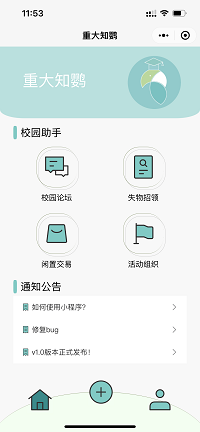
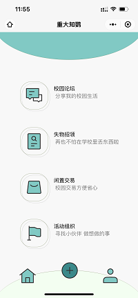
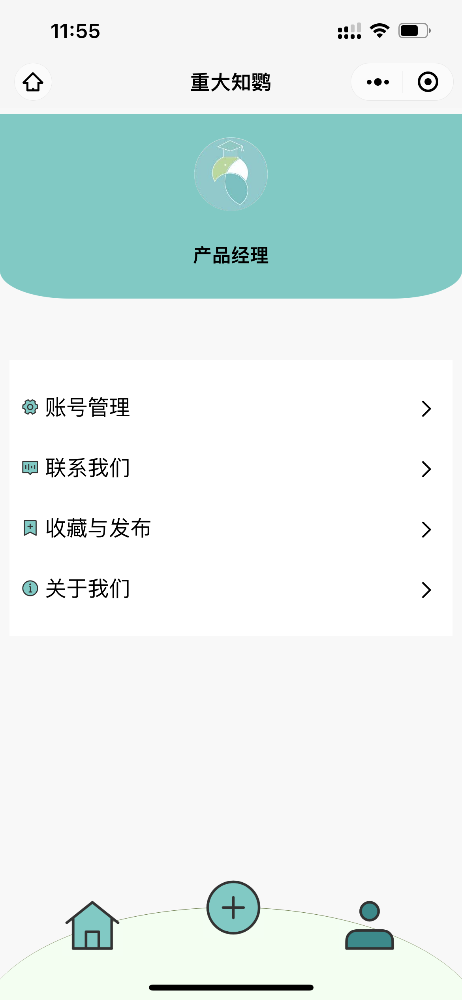
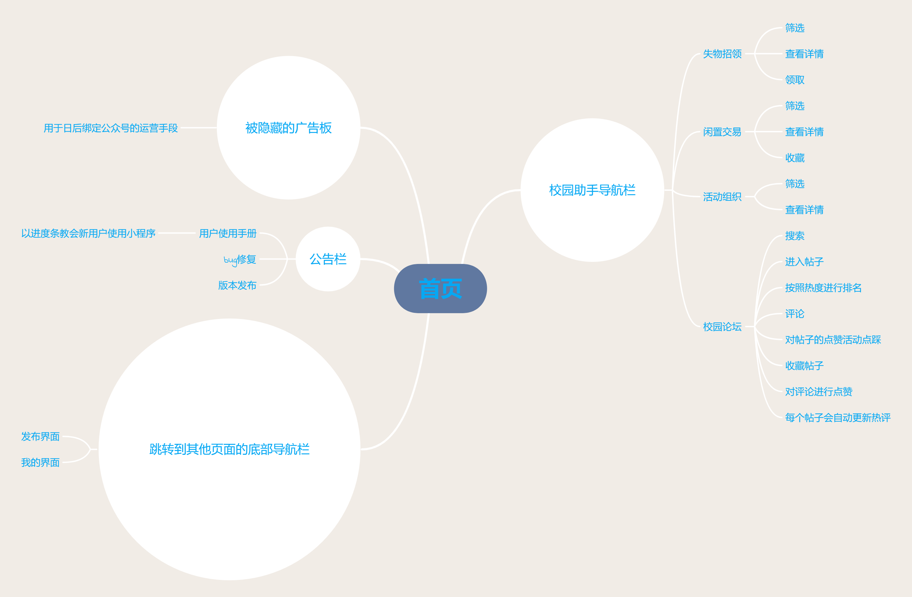
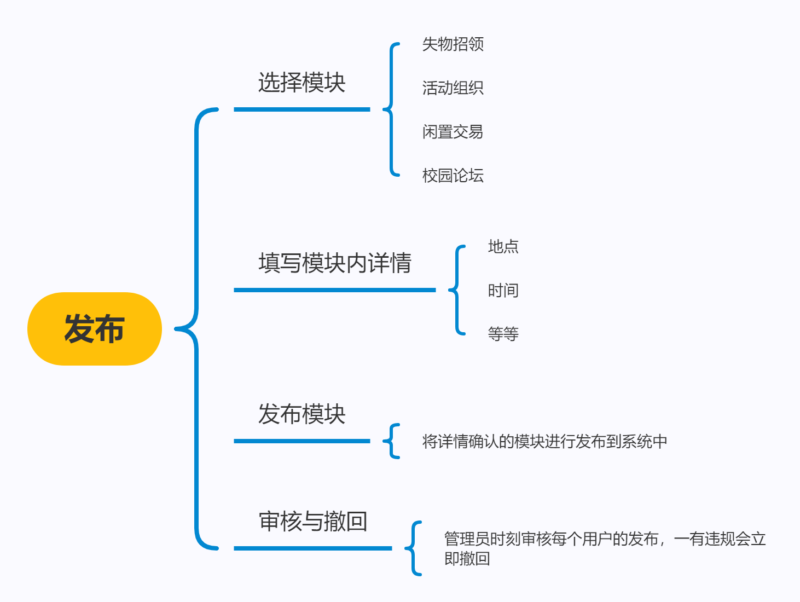
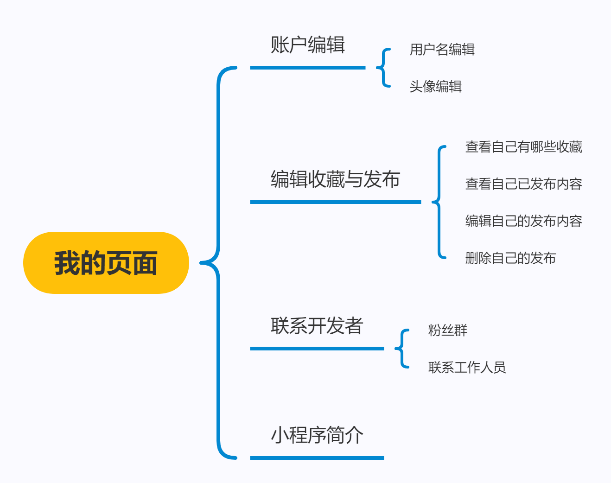

# README

## 1 Background

该作品是2021年[中国高校计算机大赛-微信小程序应用开发大赛](https://developers.weixin.qq.com/community/competition)的作品，作品为智慧校园类型的微信小程序。

针对传统校园服务的不足，团队设计并打造了智能校园信息平台,将互联网技术赋能校园服务，为广大同学们构建了方便,高效的信息交流渠道。

## 2 Detail

小程序的核心功能主要有四个（陈列在主页的四个按钮）：失物招领、校园论坛、闲置交易和活动组织（如下图），底部的三个导航栏对应着主页、发布页和个人信息页。

小程序的设计细节如下：

关于小程序的更多信息，如果你想了解，可以观看我们队发布在Bilibili上的预览片：[重大知鹦微信小程序介绍](https://www.bilibili.com/video/BV1rg411R7GD/) 

如果你想体验我们的小程序，可以扫描体验二维码，申请体验访问权限即可：

## 3 Usage&Install

先我们将我们的作品的源码公开，供对微信小程序，特别是对智慧校园类型的微信小程序感兴趣的学习交流使用。

小程序开发使用的是腾讯提供的云开发方式，没有外部服务器，本地部署即可直接运行。

为了运行项目，你可能需要：

1. 熟悉JavaScript
2. 下载[微信开发者工具](https://open.weixin.qq.com/)
3. 一个APPID或者临时测试号，在微信公众平台上获取
4. 创建项目或导入项目时，选择云开发方式

完成以上四个步骤后，将仓库克隆到本地，使用微信开发者工具打开，编译运行即可。

## 4 Notice

- 项目由我和其他三位同学共同完成，项目中使用的设计元素，部分由我们自己设计（如小程序头像和小程序名称等），部分使用了开源的UI库，如下：
    - [阿里巴巴矢量图标库](https://www.iconfont.cn/home/index?spm=a313x.7781069.1998910419.2)
    - [Vant组件](https://youzan.github.io/vant-weapp/#/quickstart)
- 项目仅供学习交流使用，有任何问题可以留言.
